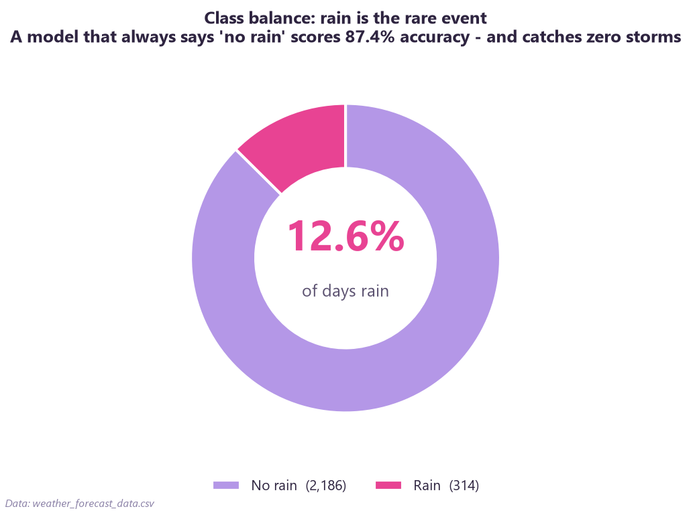
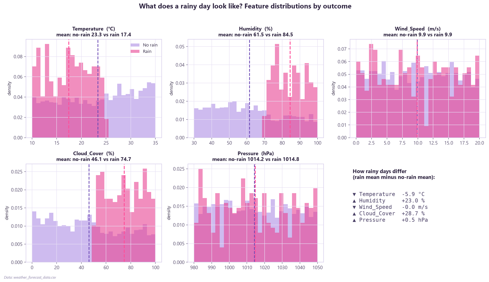
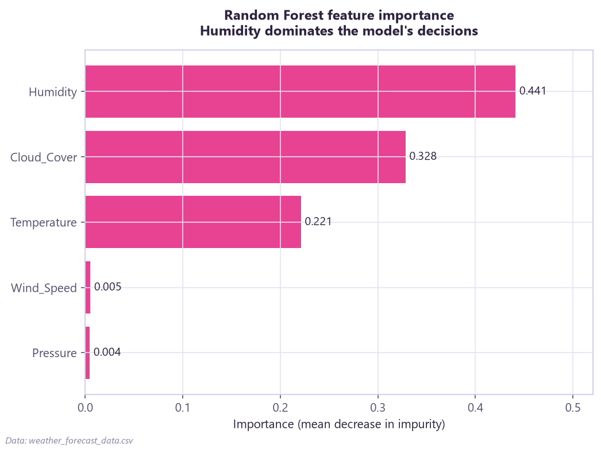

# Predicting Rain from Weather Conditions

A classification study: given a day's **temperature, humidity, wind, cloud cover, and pressure**, will it rain? Built on 2,500 weather observations, with the class imbalance treated as the central challenge — not swept under the rug.

### 📊 [**→ Open the live interactive dashboard**](https://hashtro9-rgb.github.io/rain-prediction/)

A no-scroll, tabbed dashboard (Explore · Model · Drivers) with hover tooltips, a feature selector, and a model toggle — built with Chart.js.

---

## TL;DR — what the data says

- **The imbalance trap is the whole story.** Only **12.6%** of days rain (314 of 2,500). A model that lazily predicts *"no rain" every time* is **87.4% accurate** — and catches zero storms. So this project is judged on **ROC-AUC, precision, recall, and F1 for the rain class**, never raw accuracy.
- **Rainy days look distinct:** vs. dry days they're **+23% humidity** (64% → 87%), **+29% cloud cover** (46% → 75%), and **~6°C cooler** (23°C → 17°C). Wind and pressure barely matter.
- **Three features carry the signal:** Humidity (importance 0.44), Cloud Cover (0.33), Temperature (0.22). Wind and pressure are near-zero.
- **A dead-simple rule works surprisingly well:** dry + clear skies → **0% rain**; humid + cloudy → **60% rain**.

## Model scorecard (positive class = rain, held-out test set)

| Model | ROC-AUC | Precision | Recall | F1 | Accuracy |
|---|---|---|---|---|---|
| Logistic Regression (baseline) | 0.956 | 0.525 | 0.924 | 0.670 | 0.885 |
| **Random Forest (winner)** | **1.000** | **0.988** | **1.000** | **0.994** | **0.998** |

## ⚠️ A perfect score is a red flag, not a trophy

The Random Forest hit **ROC-AUC 1.000** — it caught all 79 storms in the test set with a single false alarm. In real forecasting that's *too good to be true*, and I'm calling it out rather than bragging about it: a near-perfect model almost always means **the data was generated from a clean, near-deterministic rule** (this dataset is synthetic). Real operational weather is far noisier.

So the honest takeaway isn't "I built a 100%-accurate rain predictor." It's: **the method is sound** — proper imbalance handling, the right metrics, an interpretable baseline, agreement between two model families on which features matter — and **it would need validation on independently collected, real-world data before anyone trusted that recall in production.** Reporting the ceiling *and* its caveat is the point.

---

## Charts

| The imbalance | How rainy days differ | What drives rain |
|---|---|---|
|  |  |  |

More in [`charts/`](charts/): correlation heatmap, humidity×cloud rain-rate table, ROC curves, confusion matrix, precision-recall curve, and logistic coefficients — all discussed in **[analysis/FINDINGS.md](analysis/FINDINGS.md)**.

## Reproduce it

```bash
pip install -r requirements.txt
python analysis/rain_analysis.py
```

Runs top-to-bottom (`random_state=42`, stratified 75/25 split, `class_weight="balanced"` on both models), regenerates every chart, and writes `analysis/dashboard_data.json` + `analysis/FINDINGS.md`. The dashboard rebuilds from that JSON.

## Repo structure

```
rain-prediction/
├── README.md
├── index.html                   # live interactive dashboard (GitHub Pages)
├── requirements.txt
├── data/
│   └── weather_forecast_data.csv
├── analysis/
│   ├── rain_analysis.py          # reproducible pipeline: EDA + models + charts + json + findings
│   ├── FINDINGS.md               # full writeup, one section per question
│   └── dashboard_data.json       # aggregated results the dashboard reads
└── charts/                       # 9 publication-quality PNGs
```

## Method notes

- **Imbalance handled** with `class_weight="balanced"` on both models; evaluation centered on rain-class precision/recall/F1 and ROC-AUC.
- **Two model families** on purpose: Logistic Regression (scaled, interpretable — gives odds per feature) as the baseline, Random Forest as the main model. They **agree** on the top features, which is the real signal.
- **Future work:** gradient boosting (XGBoost / HistGradientBoosting) could squeeze out marginal gains, but adds complexity that this problem doesn't need.

*Data source: `weather_forecast_data.csv` (synthetic weather observations).*
